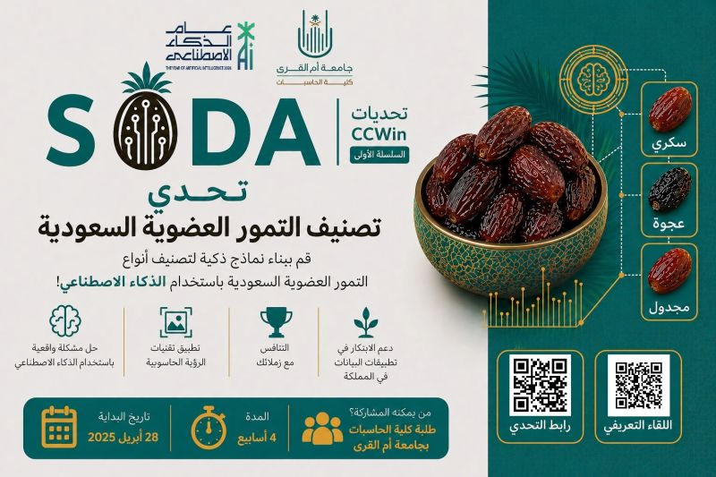

# 🌴 Date Fruit Classification (SODA Dataset Challenge)

An end-to-end Computer Vision pipeline built to classify **13 distinct varieties of date fruits** using the **YOLO26s-cls** architecture via the Ultralytics framework, optimized on an AMD ROCm Linux environment.  
  
[Challenge link](https://www.kaggle.com/competitions/soda-challenge/data)
---

## Project Overview

Dates (like *Ajwa*, *Sukari*, and *Khalas*) share highly similar external textures, skin wrinkles, and color profiles. This project leverages a YOLO classification backbone to extract fine-grained features, enabling reliable distinction between highly overlapping phenotypes.



### Key Performance Metrics:
* **Top-1 Validation Accuracy:** `85.2%`
* **Top-5 Validation Accuracy:** `98.6%`
* **Macro F1-Score:** `0.85`
* **Infrastructure:** AMD ROCm 7.2 / PyTorch / Linux

---

## Dataset Structure

The initial data featured mixed extensions (`.jpg`, `.jpeg`, `.png`) and random file ordering. We applied a stratified 80/20 train-validation split across the 13 classes. Unlabeled test images are left flat in the root test directory for automated sequential inference.

### Repository Layout:
```text
.
├── SODA.jpg                      # Banner image
├── YOLO26_Architecture.png        # Architecture visualization 
├── t9neef.ipynb                  # Main Jupyter Notebook
├── final_kaggle_submission.csv   # Final outputs generated for Kaggle
├── requirements.txt              # Environment dependencies
├── yolo26s-cls.pt                # Trained model checkpoint
│
├── data/                         # (Ignore by git)
│   ├── soda_dataset/             # Raw downloaded data and CSVs
│   └── yolo_dataset/             # Preprocessed splits
│       ├── train/                # 13 structured class subfolders (80%)
│       └── val/                  # 13 structured class subfolders (20%)
│       └── test/                 # Flat test folder for inference
│
└── classify/
    └── date_classification/
        └── yolo_date_model/      # YOLO training logs, plots, and results.csv
